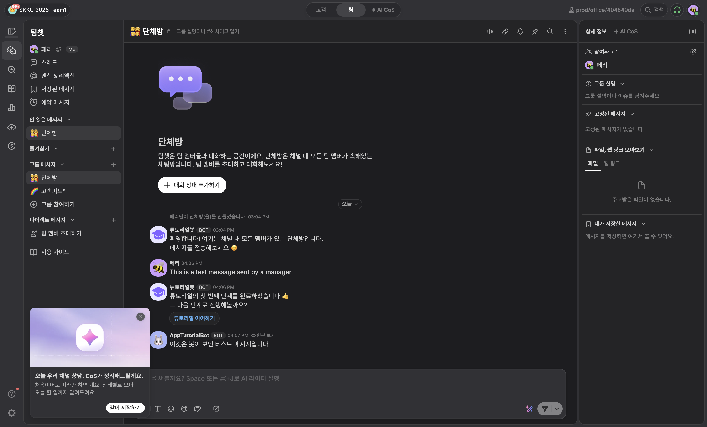

# team1 Desk 검증 기록

검증일: 2026-09-17 · 배포 소스: `c48b7e8` · Worker 버전: `ae4cb3c5-1b7c-498a-8bad-7eac038161b0`

대상은 SKKU 2026 Team1 채널(253286)의 단체방(609174), 앱 `6aab7be513f451690580`입니다.
검증 당시 참여자는 운영진 1명입니다.

## 확인한 항목

- 설치된 앱의 `/tutorial` 커맨드가 Desk 목록에 표시됩니다.
- 그룹 채팅에서 커맨드를 선택하고 실행하면 앱 서버 호출이 HTTP 200으로 완료됩니다.
- Desk WAM 컨트롤러 안에서 실제 배포된 `tutorial` 화면이 열립니다.
- 다크 테마에서 제목과 `Send as a manager`, `Send as a bot` 버튼이 표시됩니다.
- 두 버튼 모두 활성화되어 있으며, 앱 오류 배너는 표시되지 않습니다.
- WAM의 닫기 버튼을 누르면 Desk에서 창이 정상적으로 닫힙니다.
- 최초 열기·닫기 검증에서는 메시지를 생성하지 않았습니다. 이후 승인된 전송 테스트 결과는 아래와 같습니다.
- 해당 실행의 Worker 로그는 outcome `ok`, HTTP 200, CPU 5ms였습니다. 단일 실행 관측값이며 부하 시험은 아닙니다.

## 승인된 메시지 전송 검증

2026-09-17 사용자 승인 후 같은 Desk 그룹 채팅에서 WAM을 각각 새로 열어 두 버튼을 한 번씩 눌렀습니다.
두 경로 모두 전송 후 WAM이 자동으로 닫혔고, `ch desk teamchat messages`로 원문·작성자·메시지 ID를 확인했습니다.

| 경로              | 원문                                        | 작성자                        | 메시지 ID              | 결과                |
| ----------------- | ------------------------------------------- | ----------------------------- | ---------------------- | ------------------- |
| Send as a manager | `This is a test message sent by a manager.` | 페리 / manager `682614`       | `6aab916a75d609b6ce0a` | 1회 전송, 자동 닫힘 |
| Send as a bot     | `This is a test message sent by a bot.`     | AppTutorialBot / bot `759694` | `6aab91ca212c5360815e` | 1회 전송, 자동 닫힘 |

Desk의 번역 설정으로 봇 메시지가 화면에서는 한국어로 보일 수 있습니다. 저장된 원문은 위의 승인 문구와 같습니다.
매니저의 첫 메시지에 반응해 채널 기본 튜토리얼봇이 안내 메시지 1개를 자동 생성했습니다.
이는 앱 봇 전송과 별개이며, 승인된 두 테스트 메시지에 중복 전송은 없었습니다.
테스트 결과는 전용 채널에 남겨 두었습니다.

## 검증 범위

기본 그룹 채팅에서 커맨드 실행 → WAM 열기 → 매니저/봇 전송 → 자동 닫힘까지 통과했습니다.
부하 시험, 다른 팀 계정의 권한 격리, 모바일·다른 브라우저 검증은 포함하지 않습니다.

초기 자동화에서는 비활성 브라우저 탭에서 요청이 지연되다가 종료됐습니다. 탭을 활성 상태로
유지한 재검증에서는 커맨드 HTTP 200과 WAM 렌더링이 확인됐습니다. 앱 코드는 변경하지 않았습니다.

서버·DB·서명 검증·GitHub Actions 배포는 별도로 통과했습니다. 로컬 개발, SQL 마이그레이션,
원격 적용 요청과 배포 절차는 [개발 가이드](../HACKATHON.ko.md)를 참고하세요.
